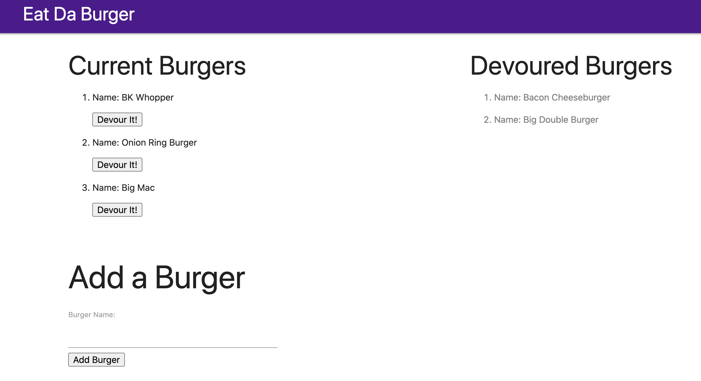

# HW-13-BurgerApp
Web app utilizing server, database, and express handlebars

https://logantwalker.github.io/
https://damp-meadow-36938.herokuapp.com/




## Installation Instructions
Install dependencies:
 ``` 
 npm i 
 ```
Seed Database:

```
cd db/
mysql -u root -p 
source schema.sql
source seeds.sql (optional)
quit
```
